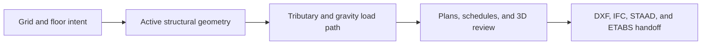
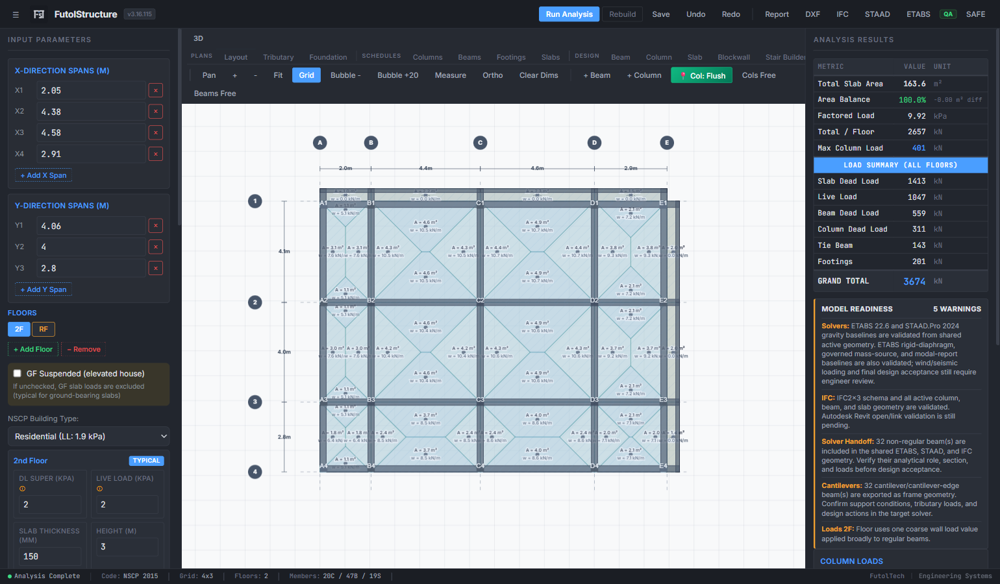
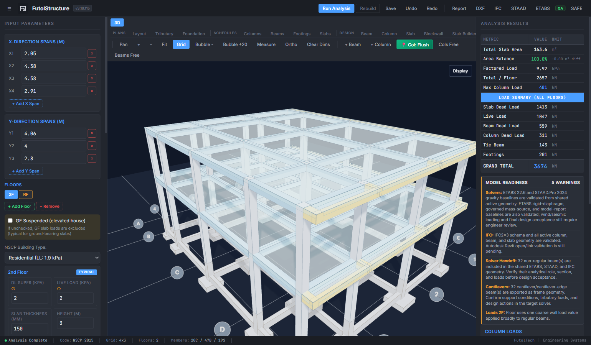
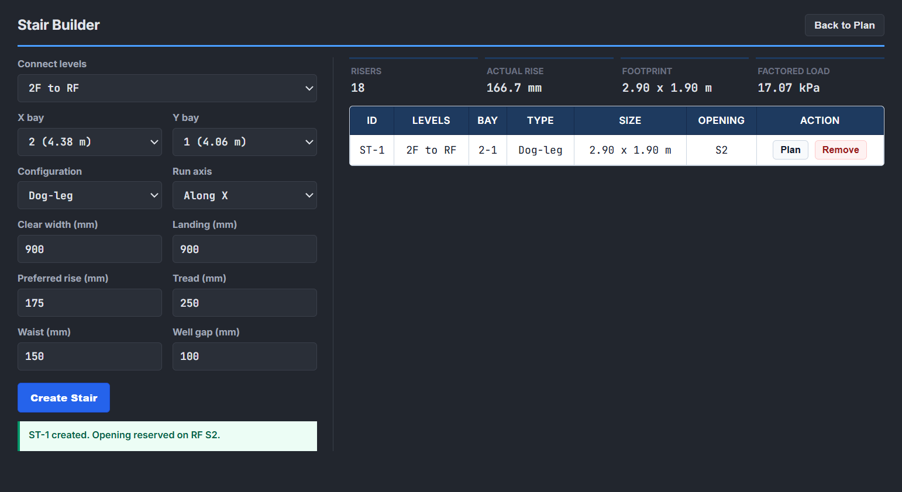

<p align="center">
  
</p>

# FutolStructure

FutolStructure is a browser-based structural engineering workbench for reinforced-concrete building layout, gravity load-path review, tributary area visualization, 3D coordination, and solver handoff preparation.

<p>
  <a href="https://futolstructure.vercel.app"><strong>Open the live technical preview</strong></a>
  &nbsp;|&nbsp;
  <a href="docs/LAUNCH_PLAN.md">Deployment</a>
  &nbsp;|&nbsp;
  <a href="SECURITY.md">Security</a>
</p>

[](https://futolstructure.vercel.app)
[](https://github.com/michaelfutol/futolstructure/actions/workflows/validate.yml)


> [!IMPORTANT]
> FutolStructure is an engineering decision-support and model-preparation tool. It does not replace project-specific analysis, code checks, geotechnical input, detailing, or review and signing by the responsible licensed engineer.

## Product Workflow



## Screenshots

### Plan, tributary, and load review



### 3D structural model



### Stair Builder



## Current Capabilities

- Grid-based RC framing with columns, beams, slabs, cantilevers, corner slab patches, and floor-specific controls.
- Tributary area and gravity load distribution from slabs to beams, columns, footings, and base reactions.
- Plan drafting aids including coordinated member tags, grid bubbles, dimensions, ortho measurement, snapping, and lock indicators.
- 3D review with display schemes, member colors and opacity controls, foundation geometry, slab transparency, and stair geometry.
- `.fstr` project save/load with guarded autosave, recovery diagnostics, floor deletion warnings, and persisted member locks.
- Stair Builder geometry with destination slab openings, DXF footprint output, and 3D review.
- Reports and schedules for columns, beams, slabs, footings/base reactions, and preliminary design summaries.
- Coordinated DXF, IFC2x3, STAAD.Pro, ETABS 22 OAPI, and ETABS-to-SAFE handoff paths.

## Solver and BIM Status

FutolStructure uses a shared active-model payload so geometry counts and member intent remain coordinated across export targets.

| Target | Current status |
| --- | --- |
| DXF | Structural plan output and governed layer mapping are active. |
| IFC2x3 | Active columns, beams, slabs, and storey organization are exported for BIM review. |
| STAAD.Pro | The gravity baseline, frame/plate geometry, beam insertion offsets, and statics balance were validated in STAAD.Pro 2024. |
| ETABS 22 | The OAPI builder creates a dated working copy, assigns the governed mass baseline, runs modal analysis, and exports audit artifacts. |
| SAFE | The supported handoff remains ETABS story export plus governed base reactions; direct browser-authored SAFE models are not claimed. |

Validated baselines do not imply final lateral design, detailing compliance, or permit readiness for an arbitrary project. The current reliable envelope is regular orthogonal low-rise RC framing; irregular and transfer behavior requires explicit solver review.

## Quick Start

No build step is required for the current static application.

```bash
git clone https://github.com/michaelfutol/futolstructure.git
cd futolstructure
python -m http.server 4173
```

Open `http://127.0.0.1:4173/v3/index.html`.

## Validation

Run the syntax and engine smoke check:

```bash
node v3/tools/check-fs.js --no-browser
```

Run the full browser smoke check with Chrome or Edge installed:

```bash
node v3/tools/check-fs.js
```

The browser smoke covers initialization, plan geometry, slab ownership, cantilever behavior, persistence and recovery guards, member locking, measurement tools, stair persistence, 3D rendering, and export payload parity.

## Repository Layout

```text
futolstructure/
|-- .github/              Release checks and contribution templates
|-- docs/                 Launch, security architecture, and release notes
|-- v3/
|   |-- assets/           Product identity and screenshots
|   |-- engine/           Extracted structural calculation helpers
|   |-- tools/            Regression smoke runner
|   `-- index.html        Current application
|-- index.html            Hosted root entry
|-- vercel.json           Static deployment and security headers
`-- README.md
```

## Data and Security Boundary

- The public technical preview is local-file first and does not yet provide user accounts or cloud project storage.
- `.fstr` model data stays in the browser or in files explicitly saved by the user.
- Experimental client-side AI key panels are disabled for the public preview. Future AI or collaboration features must use an authenticated server boundary and explicit project-data consent.
- Private project files and native solver artifacts are excluded from source control and Vercel deployments.

See [SECURITY.md](SECURITY.md) for vulnerability reporting and [docs/AUTH_SECURITY_PLAN.md](docs/AUTH_SECURITY_PLAN.md) for the planned Supabase authentication and row-level-security architecture.

## Deployment

- Production preview: https://futolstructure.vercel.app
- Custom domain target: https://futolstructure.futoltech.com
- Release workflow: pull request preview, automated validation, merge to `main`, then Vercel production deployment.

The custom domain requires its DNS record before it becomes public. See [docs/LAUNCH_PLAN.md](docs/LAUNCH_PLAN.md) for the exact record and verification command.

## Project Status

The product is under active technical validation. Near-term work focuses on protected `.fstr` revisions, solver export truth, authenticated cloud projects, stair analytical connectivity, and continued BIM round-trip testing.

Contributions should preserve engineering traceability and avoid claims beyond validated behavior; read [CONTRIBUTING.md](CONTRIBUTING.md) before opening a pull request.

## Author

FutolTech - Engineering & Project Systems

Copyright (c) 2026 Michael Futol. All rights reserved. See [LICENSE](LICENSE).
